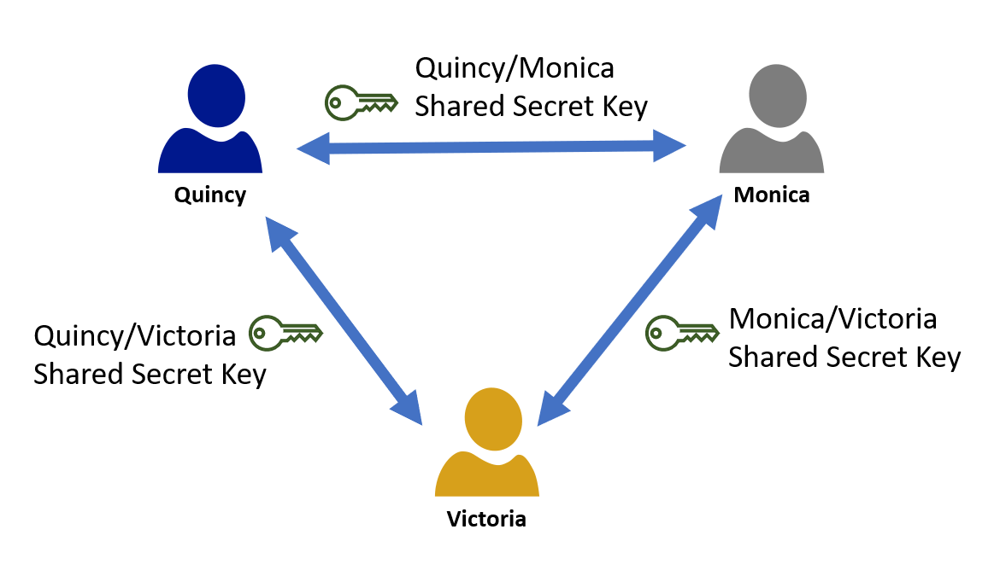
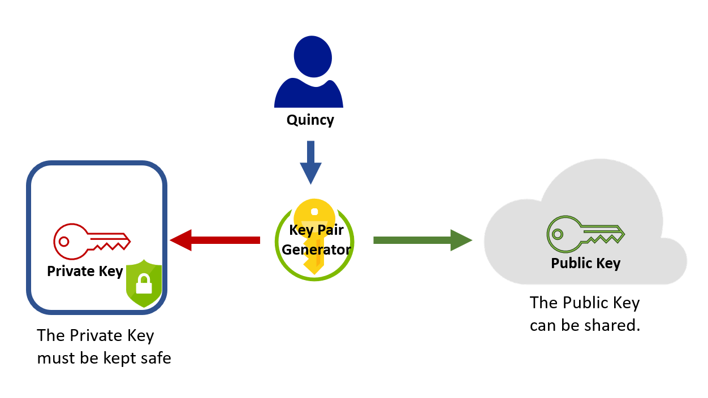
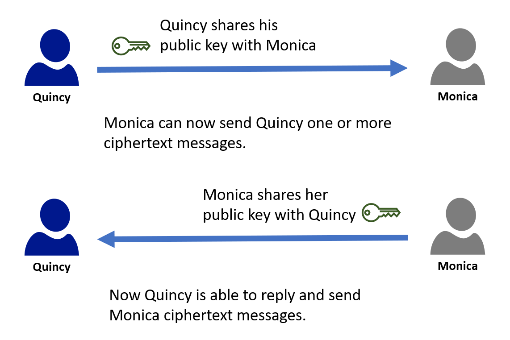
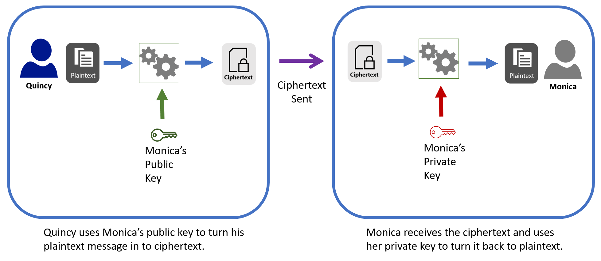

## Microsoft course
[Describe basic cybersecurity threats, attacks, and mitigations](https://learn.microsoft.com/en-us/training/modules/describe-basic-cybersecurity-threats-attacks-mitigations/)

- Confidentiality: Information should only be visible to the right people.
- Integrity: Information should only be changed by the right people or processes.
- Availability: Information should be visible and accessible whenever needed.

More information in the first link

## Pictures
 

 

 

 

 

 

Encryption explanation: [video](https://www.microsoft.com/en-us/videoplayer/embed/RWNyAM?postJsllMsg=true)