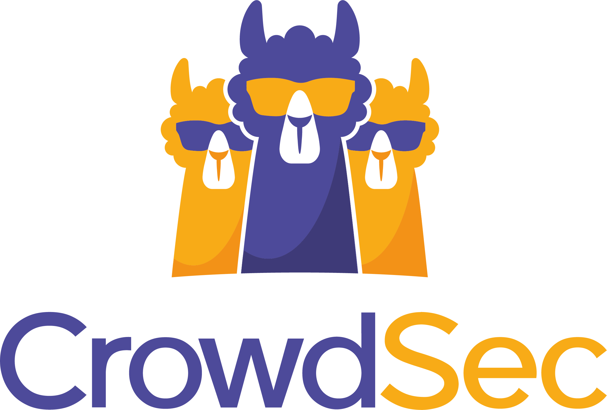

## Cybersecurity OS
- Download Kaki Linux: [Official link](https://www.kali.org/)
- Download Parrot OS : [Official link](https://www.parrotsec.org/)

## Study
- [Basic concepts](https://drive.google.com/file/d/1pnFwGx9WvZRkgQgVS3dJav3juXRwUYj4/view)
- [Introduction](https://drive.google.com/file/d/17r0xNzaWsrHZGOnxXK0TB6wt3j73qohm/view)
- [Pentesting](https://drive.google.com/file/d/15PcIyOWoIuSVfUykMu5LaR3lpI-fsHs0/view)
- [Mail security](https://drive.google.com/file/d/1eDkl0msS3i3Tm1qjeVxzWddmpSqzake5/view)

## CyberSecurity links
- 10 Most Common Types: [Malware Attacks](https://arcticwolf.com/resources/blog/8-types-of-malware)
- Educa web: [Official link](https://www.educaweb.com/profesion/especialista-ciberseguridad-991/)
- [Cybersecurity vs IT security vs Information Secuirty](https://www.lisainstitute.com/blogs/blog/diferencia-ciberseguridad-seguridad-informatica-seguridad-informacion)
- [Tips for best practices](https://www.titanfile.com/blog/cyber-security-tips-best-practices/)

## Check your email or password
- Youtube explanation: [link](https://www.youtube.com/watch?v=zJ37hsUEICA)
- Have I been pwned? [official link](https://haveibeenpwned.com/)

## Tools
<table>
  <thead>
    <tr>
      <th>Homepage</th>
      <th>Documentation</th>
    </tr>
  </thead>
  <tbody>
    <tr>
      <td>
        <a href="https://nmap.org/">
          
        </a>
      </td>
      <td><a href="https://nmap.org/docs.html">Official documentation</a></td>
    </tr>
    <tr>
      <td>
        <a href="https://docs.crowdsec.net/">
          
        </a>
      </td>
      <td><a href="https://docs.crowdsec.net/docs/intro">Official documentation</a></td>
    </tr>
    <tr>
      <td>
        <a href="https://www.kali.org/tools/wifite/">
          
        </a>
      </td>
      <td><a href="https://www.kali.org/tools/wifite/">Official documentation</a></td>
    </tr>
  </tbody>
</table>

## Lessons
First lesson - [Python for Cybersecurity](https://medium.com/cyberdefendersprogram/python-for-cyber-security-lesson-1-introduction-to-python-1976d817976)

## Cross-site scripting (XSS)
Almost everything you need to know about [XSS](https://portswigger.net/web-security/cross-site-scripting)

## Hashes
[All Hash Generator](https://www.browserling.com/tools/all-hashes)

## HTTP Strict Transport Security (HSTS)
Wikipedia: [link](https://en.wikipedia.org/wiki/HTTP_Strict_Transport_Security)

## OSI Model
| Layer | What does it do= | Where is it implemented? |
|---|---|---|
| 7º Application | Where humans process data and information | Software |
| 6º Presentation | Ensures data is in a usable format | Software |
| 5º Session | Capable of maintaining connections | Software |
| 4º Transport | Data is forwarded to a service capable of handling requests | Connects the software and hardware layers |
| 3º Network Layer | Responsible for which path packets should travel on a network | Hardware |
| 2º Data Link | Responsible for which physical devices packets should go to | Hardware |
| 1º Physical | The physical infrastructure to transport data | Hardware |

## Deep Web vs Dark Web vs Darknet
Differences between [them](https://www.xataka.com/servicios/deep-web-dark-web-darknet-diferencias)

## Tutorials
- Cyber Security: [JAVATPOINT tutorial](https://www.javatpoint.com/cyber-security-tutorial)
- SQL injection: [W3Schools](https://www.w3schools.com/sql/sql_injection.asp)
- Ethical hacking: [JAVATPOINT tutorial](https://www.javatpoint.com/ethical-hacking)

## Cybersecurity software
What is a cybersecurity software for?: [link](https://www.redseguridad.com/actualidad/software-de-ciberseguridad_20220816.html)

## OpenWebinars
Shell Scripting on [Windows](https://openwebinars.net/blog/shell-scripting-en-sistemas-windows/)

## Bash shell course
<a href="https://www.ra-ma.es/libro/curso-de-programacion-bash-shell_140505/">
  
</a>

## Online tools
- Antivirus online [Xataka](https://www.xataka.com/basics/16-antivirus-online-gratis-para-buscar-amenazas-descargar-nada)
- Surf on the net [without ads and safely](https://adguard.com/en/welcome.html)

## Information security (Ceupe policies)
<a href="https://www.ceupe.com/blog/ejemplo-politica-seguridad-informacion-y-sgsi.html">
  
</a>

- Pirani policies: [picture](https://www.piranirisk.com/es/academia/especiales/guia-politica-de-seguridad-de-la-informacion)

## GitHub repositories
- The art of hacking: [Official link](https://github.com/The-Art-of-Hacking/h4cker)
- Awesome Machine Learning for Cyber Security: [Official link](https://github.com/jivoi/awesome-ml-for-cybersecurity)
- Security Study Plan: [Official link](https://github.com/jassics/security-study-plan)
- A web hacking toolkit: [docker image](https://github.com/hueristiq/web-hacking-toolkit)

## Security for web development
15 Critical Security Tips for Web Development in 2023: [Official link](https://www.netguru.com/blog/web-development-security)

## Firewall ports - Windows 10
How to close or open Firewall ports in Windows 10? [Official link](https://computerhoy.com/noticias/internet/como-cerrar-abrir-puertos-del-firewall-windows-10-73051)

## Encryption vs firewall
Does encryption make the firewall irrelevant?: [Official link](https://news.sophos.com/es-es/2019/12/05/el-cifrado-hace-que-el-firewall-sea-irrelevante/)

## 25 types of cyber attacks
How to prevent all them?: [Official link](https://ciberseguridad.blog/25-tipos-de-ataques-informaticos-y-como-prevenirlos/)

## INCIBE
- Cybersecurity courses: [vimeo](https://ciberseguridad.blog/25-tipos-de-ataques-informaticos-y-como-prevenirlos/)
- Defacement: [definition](https://www.incibe.es/aprendeciberseguridad/defacement)
- Web spoofing: [Official link](https://www.incibe.es/empresas/blog/spoofing-todo-lo-que-necesitas-saber-para-proteger-tu-empresa)
- Glossary of Cybersecurity Terms: [Official link](https://www.incibe.es/sites/default/files/contenidos/guias/doc/guia_glosario_ciberseguridad_2021.pdf)
- Downloadable Challenges: [Official link](https://www.incibe.es/ed2026/talento-hacker/academia-hacker/retosdescargables)

## Practice ethical hacking attacks
- Vulnerable OS: [Blog](https://blog.elhacker.net/2022/02/sistemas-vulnerables-para-practicar-legalmente-pentesting.html)

<table>
  <thead>
    <tr>
      <th>
        Recommendations: <a ref="https://www.redeszone.net/tutoriales/seguridad/paginas-aprender-hacking-etico-internet/">RedesZone</a>
      </th>
    </tr>
  <thead>
  <tbody>
    <tr>
      <td>Hack The Box: <a ref="https://www.hackthebox.com/">Official link</a></td>
    </tr>
    <tr>
      <td>Tryhackme: <a ref="https://tryhackme.com/">Official link</a></td>
    </tr>
    <tr>
      <td>Pentester Lab: <a ref="https://pentesterlab.com/">Official link</a></td>
    </tr>
    <tr>
      <td>VulnHub: <a href="https://www.vulnhub.com/">Official link</a></td>
    </tr>
    <tr>
      <td>HackThis: <a href="https://defendtheweb.net/">Official link</a></td>
    </tr>
    <tr>
      <td>Google Gruyere: <a href="https://google-gruyere.appspot.com/">Official link</a></td>
    </tr>
    <tr>
      <td>OverTheWire: <a href="https://overthewire.org/wargames/">Official link</a></td>
    </tr>
    <tr>
      <td>bWAPP: <a href="http://www.itsecgames.com/">Official link</a></td>
    </tr>
    <tr>
      <td>Offensive Security: <a href="https://www.offsec.com/">Official link</a></td>
    </tr>
    <tr>
      <td>Cybrary: <a href="https://www.cybrary.it/">Official link</a></td>
    </tr>
    <tr>
      <td>
        HackThisSite: <a href="https://www.hackthissite.org/pages/index/index.php">Official link</a>
      </td>
    </tr>
    <tr>
      <td>Root Me: <a href="https://www.root-me.org/">Official link</a></td>
    </tr>
  </tbody>
</table>

## Ways to view Real-Time Cyberattack Maps
Live Hacking Attack: [Geekflare link](https://geekflare.com/real-time-cyber-attacks/)

## Google Dorking
Google Dorking , also known as Google Haking, is a hacker technique which consists of applying Google's advanced search to find specific information on the Internet by filtering the results with operators (known as dorks).

- Incibe: [Google dorks help you to find information about yourself online.](https://www.incibe.es/ciudadania/blog/google-dorks-te-ayuda-encontrar-informacion-sobre-ti-en-la-red)
- Google dorking: [Useful link](https://derechodelared.com/google-dorking-que-es/)
- GHDB (Google Hacking DataBase): [Google dorks](https://www.exploit-db.com/google-hacking-database)

## Youtube legends
- S4VITAR: [Youtube channel](https://www.youtube.com/c/s4vitar)
- TheGoodHacker: [Youtube channel](https://www.youtube.com/c/thegoodhacker)

## SQL INJECTION
GitHub repository: [Official link](https://github.com/sqlmapproject/sqlmap)

```bash
python sqlmap.py -u <<url>> --dbs
```